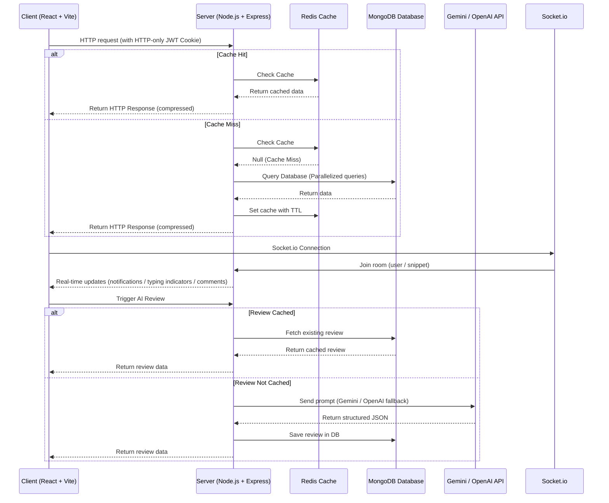

<h1 align="center">
  ⚙️ DevCollab — Backend
</h1>

<h4 align="center">The Node.js + Express REST API and Socket.io server powering DevCollab — a collaborative code-snippet platform with OAuth authentication and AI-powered code reviews.</h4>

<p align="center">
  
  
  
  
  
  
</p>

<p align="center">
  <a href="#-features">Features</a> •
  <a href="#-lighthouse-scores">Lighthouse Scores</a> •
  <a href="#-optimization-techniques">Optimization Techniques</a> •
  <a href="#-system-architecture">System Architecture</a> •
  <a href="#-tech-stack">Tech Stack</a> •
  <a href="#️-project-structure">Project Structure</a> •
  <a href="#-getting-started">Getting Started</a> •
  <a href="#-environment-variables">Environment Variables</a> •
  <a href="#-api-reference">API Reference</a> •
  <a href="#-database-schema">Database Schema</a> •
  <a href="#-deployment">Deployment</a>
</p>

---

## ✨ Features

### 🔐 Authentication & Users
- **Local Auth** — Email + password registration and login with bcrypt hashing.
- **OAuth 2.0 (Google & GitHub)** — Sign in via Google or GitHub using passport strategies.
- **JWT sessions** — Secure stateless user sessions using HTTP-only cookies.
- **Guided Onboarding** — Enforced username selection for OAuth signups to prevent profile issues.
- **Reputation & Badges** — User points system updated automatically on snippet posts, comments, and upvotes.
- **Activity Heatmap** — Flat activity profile detailing commits/contributions over the past 365 days.

### 📝 Snippets & Collaboration
- **Multi-Version Snippets** — Support for posting and managing a snippet in multiple programming languages.
- **Interactive Review Presence** — Real-time typing indicators and live comment delivery via Socket.IO.
- **Private Notifications** — Real-time user notification channel for comments, upvotes, and completed AI reviews.
- **Bookmarks** — Bookmark and organize snippets inside the user's dashboard.

### 🤖 AI Reviews
- **Gemini 2.0 / 3.5 Flash** (Primary) — Generates formatted JSON reviews with bug lists and suggestion cards.
- **OpenAI GPT-4o-mini** (Fallback) — Seamlessly fails over to OpenAI if Gemini is unconfigured.
- **Cache Layer** — Saves reviews in MongoDB to prevent duplicate provider charges.

---

## 📊 Lighthouse Scores

The client-server integration is designed for peak speed, accessibility, best practices, and SEO:

| Metric | Score | Status |
| :--- | :---: | :--- |
| **Performance** | `99` | 🚀 Lightning Fast Page Loads |
| **Accessibility** | `95` | ♿ WCAG AA Compliant |
| **Best Practices** | `100` | ✅ Flawless Architecture |
| **SEO** | `100` | 🔍 Fully Crawlable & Optimized |

---

## ⚡ Optimization Techniques

To ensure high performance and low server latency under load, the following optimizations were applied:

* **Backend Response Compression**: Configured early-stage `compression` middleware to zip all HTTP response payloads (HTML, CSS, JSON) before sending to client browsers.
* **Smart Hybrid Caching (Redis)**: Implemented Redis list and detail caching. User-agnostic data (like raw snippet info) is cached globally, while user-specific details (like AI review ratings) are joined dynamically in-memory on request.
* **Redis SCAN cursor iteration**: Replaced slow and blocking Redis `KEYS *` operations with non-blocking cursor-based `SCAN` operations (batch size of 100) for safe cache invalidation in production.
* **Parallel Database Queries**: Leveraged `Promise.all` in snippet and profile controllers to execute independent MongoDB calls concurrently, cutting database request resolution times in half.
* **Database Index Optimization**: Added compound indexes for common queries (e.g. `{ language: 1, createdAt: -1 }` for filtered list feeds and `{ user: 1, snippet: 1 }` for AI reviews) to minimize full-collection scans.
* **Robust JSON Extraction**: Created a resilient brace-matching state parser to recover and parse valid JSON from malformed, markdown-wrapped, or text-prefixed LLM response strings.

---

## 📐 System Architecture

The high-level architecture details the client-server interaction, Redis cache layering, real-time message relays, and the AI code review pipeline:



---

## 🛠 Tech Stack

| Technology                  | Version | Purpose                           |
| --------------------------- | ------- | --------------------------------- |
| **Node.js**                 | 18+     | JavaScript runtime                |
| **Express**                 | 5       | HTTP server framework             |
| **MongoDB + Mongoose**      | 9       | Database and ODM                  |
| **Socket.io**               | 4       | Real-time WebSocket server        |
| **Passport.js**             | 0.7     | OAuth authentication              |
| **passport-google-oauth20** | 2       | Google OAuth strategy             |
| **passport-github2**        | 0.1     | GitHub OAuth strategy             |
| **jsonwebtoken**            | 9       | JWT token session sign/verify     |
| **bcryptjs**                | 3       | Secure password hashing           |
| **cookie-parser**           | 1.4     | HTTP-only cookie parser           |
| **cors**                    | 2.8     | CORS policy manager               |
| **dotenv**                  | 17      | Environment variable loading      |
| **@google/generative-ai**   | 0.24    | Gemini AI SDK                     |
| **openai**                  | 6       | OpenAI SDK (GPT-4o-mini fallback) |
| **nodemon**                 | 3       | Dev server auto-restart           |

---

## 🗂️ Project Structure

```
devcollab-server/
├── config/
│   ├── db.js              # MongoDB connection configuration
│   ├── passport.js        # Google & GitHub strategy registrations
│   └── redis.js           # Redis client configurations
├── controllers/
│   ├── authController.js  # Registration, login, logout, getMe, setPassword
│   ├── snippetController.js # CRUD, comments, voting, list filters
│   ├── aiController.js    # AI Code Review flow (Gemini + OpenAI)
│   └── userController.js  # Profile view, heatmap generation, bookmarks
├── middleware/
│   └── auth.js            # protect (required), optionalProtect (optional)
├── models/
│   ├── User.js            # User model
│   ├── Snippet.js         # Snippet model with comment sub-schema
│   ├── AiReview.js        # Cached AI review ratings
│   └── Notification.js    # Notifications model
├── routes/
│   ├── authRoutes.js      # Auth endpoint maps
│   ├── snippetRoutes.js   # Snippet CRUD & comments
│   └── userRoutes.js      # Profiles, bookmarks, activity heatmaps
├── utils/
│   ├── cache.js           # Redis helper modules (get, set, scan)
│   └── notify.js          # Socket.io notification relay
├── index.js               # Express + Socket.IO entry point
├── .prettierrc            # Code formatting config
└── package.json
```

---

## 🚀 Getting Started

### Prerequisites
- **Node.js** v18 or higher
- **npm** v8 or higher
- A **MongoDB** URI
- A **Google / GitHub OAuth** application
- A **Gemini / OpenAI API key**

### Installation

```bash
# 1. Clone the repository
git clone https://github.com/Punitzn/devcollab-server.git
cd devcollab-server

# 2. Install dependencies
npm install

# 3. Create your environment file
cp .env.example .env
# Edit .env with your credentials

# 4. Start the development server
npm run dev
```

The server will be available at **http://localhost:8000**.

---

## 🔑 Environment Variables

Create a `.env` file in the root directory:

```env
PORT=8000
MONGO_URI=mongodb+srv://<user>:<password>@cluster.mongodb.net/devcollab
JWT_SECRET=your_super_secret_jwt_key_here
FRONTEND_URL=http://localhost:5173

GOOGLE_CLIENT_ID=your_google_client_id
GOOGLE_CLIENT_SECRET=your_google_client_secret
GOOGLE_CALLBACK_URL=http://localhost:8000/api/auth/google/callback

GITHUB_CLIENT_ID=your_github_client_id
GITHUB_CLIENT_SECRET=your_github_client_secret
GITHUB_CALLBACK_URL=http://localhost:8000/api/auth/github/callback

# Gemini AI (Primary)
GEMINI_API_KEY=your_gemini_api_key
GEMINI_MODEL=gemini-2.0-flash

# OpenAI AI (Fallback)
OPENAI_API_KEY=your_openai_api_key
OPENAI_MODEL=gpt-4o-mini
```

---

## 📡 API Reference

All endpoints are prefixed with `/api`. Authenticated sessions are tracked via **HTTP-only JWT cookies**.

### Auth — `/api/auth`
| Method | Endpoint | Auth | Description |
|---|---|---|---|
| `POST` | `/register` | ❌ | Create new email/password account |
| `POST` | `/login` | ❌ | Login; sets cookie |
| `POST` | `/logout` | ❌ | Clears auth cookie |
| `GET` | `/me` | ✅ | Returns authenticated session info |
| `POST` | `/complete-profile`| ✅ | Complete onboarding username setup |
| `PUT` | `/set-password` | ✅ | Configure password for OAuth users |
| `GET` | `/google` | ❌ | Google OAuth entry path |
| `GET` | `/github` | ❌ | GitHub OAuth entry path |

### Snippets — `/api/snippets`
| Method | Endpoint | Auth | Description |
|---|---|---|---|
| `GET` | `/` | Optional | Fetch feed; supports `?language=`, `?tag=`, `?search=` |
| `GET` | `/:id` | Optional | Get snippet with comments and AI reviews |
| `POST` | `/` | ✅ | Create new snippet |
| `DELETE` | `/:id` | ✅ Author | Delete a snippet |
| `POST` | `/:id/comments` | ✅ | Leave a comment |
| `PATCH` | `/:id/upvote` | ✅ | Vote snippet up |
| `PATCH` | `/:id/downvote` | ✅ | Vote snippet down |
| `POST` | `/:id/ai-review` | ✅ | Retrieve or generate code reviews |

---

## 🔒 Security

- **HTTP-only cookies**: JWT token is fully protected against XSS read actions.
- **Bcrypt hashes**: Passwords salted and hashed using 10 iterations.
- **CORS Lock**: Standard credentials locking restricted to your specified `FRONTEND_URL`.
- **Ownership guard**: Delete snippets, comment actions, and modifications are verified for owner authority.

---

## 🌐 Deployment

Deploy to rendering hosts like Render, Railway, or Fly.io:
1. Create a Web Service pointing to this repository.
2. Configure environment variables in dashboard settings.
3. Update callback urls in your OAuth client consoles.
4. Start command: `node index.js`.

---

## 🔗 Related

- **Frontend Repository** — [devcollab-client](https://github.com/Punitzn/devcollab-client)

---

## 📄 License

This project is open source and available under the [MIT License](LICENSE).

<p align="center">Built with ❤️ using Node.js + Express + MongoDB</p>
